# zapDelphi

Delphi library for integration with the official whatsapp cloud API.

# Table of contents
- [zapDelphi](#zapdelphi)
- [Table of contents](#table-of-contents)
- [Install](#install)
	- [Using `boss`](#using-boss)
- [Usage](#usage)
- [Usage](#usage-1)
- [Configuration](#configuration)
	- [Whatsapp Cloud Api](#whatsapp-cloud-api)
		- [Development Mode](#development-mode)
		- [Live Mode](#live-mode)
		- [Api config](#api-config)
- [Nuances](#nuances)
	- [In test mode only registered phone number work](#in-test-mode-only-registered-phone-number-work)
	- [Retry messages](#retry-messages)
- [Tests](#tests)
- [TODO](#todo)

# Install

## Using `boss`
Just use the following command:

```console
$ boss install github.com/Joao-Peterson/zapDelphi
```

If asked for permission, you can login with your github credentials. **(must be done in powershell or cmd with administrator mode)**
```console
$ boss login
> Url to login (ex: github.com): github.com
> Use SSH(y or n):
> n
> Username: your_username
> Password: your_password
```

# Usage

* **Warning**: If you pretend to use business initiated messages, ie. you want to send a message to the customer first, you are going to need to create a message template before hand on the whatsapp business platform, said message goes trought a review and will be available at a maximum of 24 hours after creation because of the manual verification, so prepare for that.

* **Wanrning**: For testing use a test number provided by the meta developers platform, but when you want to do things for real beware that you are going to need a new valid number for usage as a whatsapp business number.


Note: ssh isn't supported, hence the **'n'** for not using ssh. See this issue with boss: https://github.com/HashLoad/boss/issues/52. Check it out because it may be working in the future.

# Usage

Have a look at the tests unit [Utests.pas](test/Utests.pas) for minimal examples. This is a simple text message sent to a number:

```pascal
uses
    System.Classes,
    System.SysUtils,
	System.Net.HttpClient,
    Uzap,
    Uzap.Types;

procedure sample();
	var token                := 'EAASedUjaj8qdaUBgAOyu8ZBX ... 8Srfouzlj4Tw7ZD7ZD';
	var webhookToken         := 'userDefinedWebhookToken';
	var phoneid              := '108491275438361';
	var businessAccountid    := '103038631267809';
	var notificationTemplate := 'templateMessageName';
	var receiveNumber        := '5549999814367';

	try
		var zap := Tzap.Create(phoneid, token);
		var res: IHTTPResponse;
		var status := zap.sendText(
			receiveNumber,
			'hello there!',
			res
		);
	except
		on E: Exception do raise;
	end;

	zap.Destroy();
	config.Destroy();
end;  
```

# Configuration

## Whatsapp Cloud Api

The whatsapp cloud api requires a couple of steps to configure so it can be used with this library, to start we can setup a test app in development mode and later do things for real in live mode. I will assume you are gonna use webhooks alongside the API to listen to notifications, so we will configure a webhook service alongside.

### Development Mode

1. Create an account on the [meta developers website](https://developers.facebook.com)
2. Go to `My apps` and then on `Create App`.

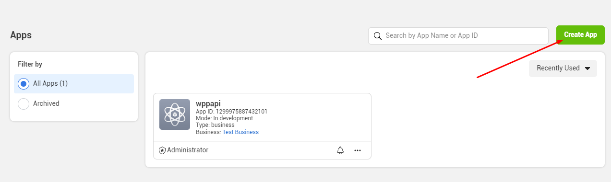

3. Select `Business` app.
4. Insert a app name and email for contact. The Business Account can be left as is for now.
5. Click on your new app.
6. Scroll to `Add Products`.

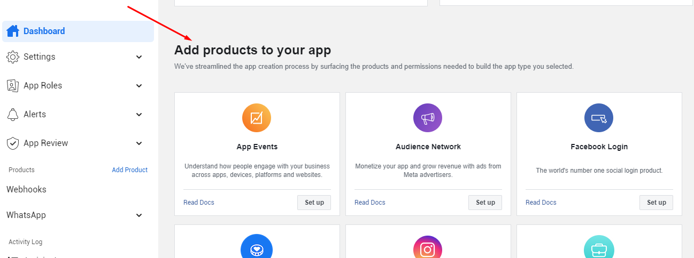

7. Click on `whatsapp` and follow along with the setup.
9. Back on the last screen also add `webhooks` and follow along.
10. Click on `Webhooks` then subscribe to the `messages` webhook.

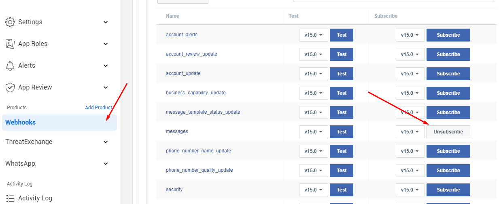

1.  To setup the webhook we need a public secure url (https), for testing can use a webhook interceptor like [Beeceptor](https://beeceptor.com), if you choose this one please jump to step 15, but i'm gonna use `ngrok` so we can write our own webserver later to receive these webhooks, first go to the [website](https://ngrok.com) make an account and [instal ngrok](https://ngrok.com/download).
2.  Follow the [getting started guide](https://ngrok.com/docs/getting-started#step-3-connect-your-agent-to-your-ngrok-account)
3.  Then run on your local host (substitute PORT by your configured tcp port):

```console
$ ngrok http PORT --region=us
```
* **Warning**: Regions other than `us` might not work with the cloud API.
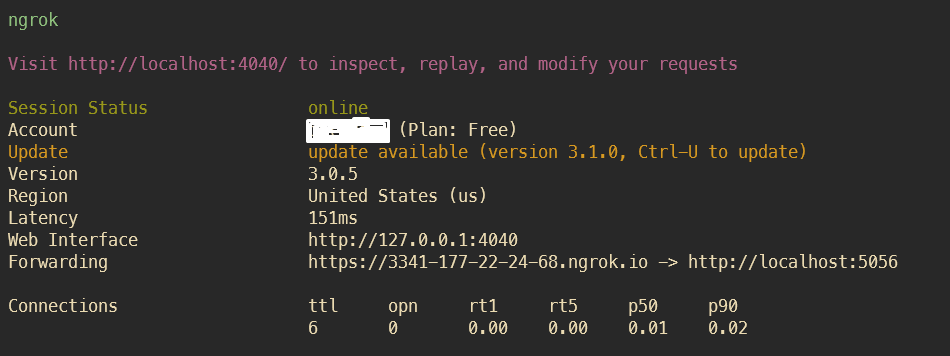

14. Now that we have our endpoint to receive events from the webhook we can use any type of webserver to receive these requests, i recommend you use the same Delphi application that you will use to send the messages as a webserver, using a framework like [Horse](https://github.com/HashLoad/horse) or [DMVC](https://github.com/danieleteti/delphimvcframework) for example and then follow [this guide](https://developers.facebook.com/docs/whatsapp/cloud-api/get-started#configure-webhooks) on how to setup a endpoint to receive these webhooks. After you have a service setup with a route named `whatsappWebhook` for example, go to the dashboard on `Whatsapp` and then `configuration`. Click `Edit`.

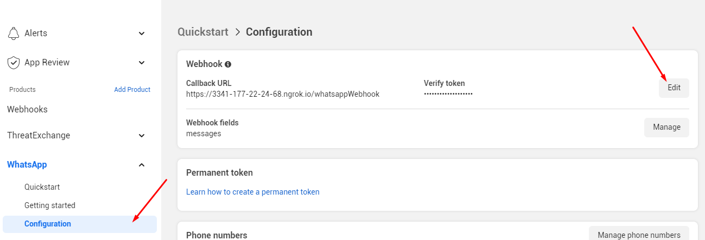

15. Copy the `https` link from the `ngrok` console made in step `13` and paste it in the box alongside with the token made in step `14`. Remeber to append the route `/whatsappWebhook` to the url.

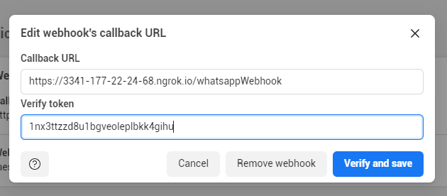

16.  Click `Verify and Save`. If an error occurs, test the connection to the webserver by pinging the `ngrok` url, and maybe consider debugging the server route handlers to if data has been received.

17.  If it sets up correctly, test by going to the screen on `webhooks` and send a test, you should see a log of the request on the log file.

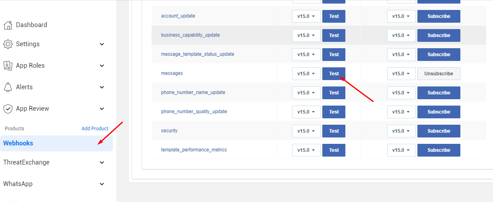

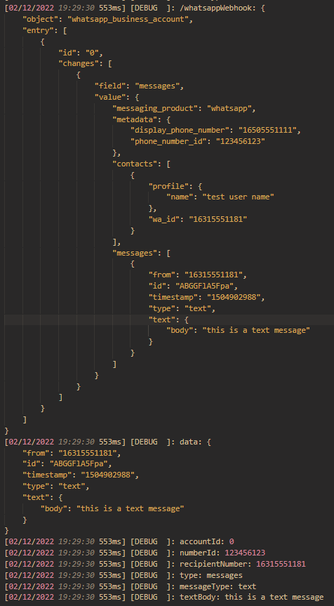

18. Now go back to the `whatsapp` and `Getting started` screen and copy all the info to the config file. Put `Temporary access token > token`, `Phone number ID > phoneid` and `WhatsApp Business Account ID > businessAccountid`.
19. Go to the [business plataform](https://business.facebook.com/home), then go to `Whatsapp Manager`

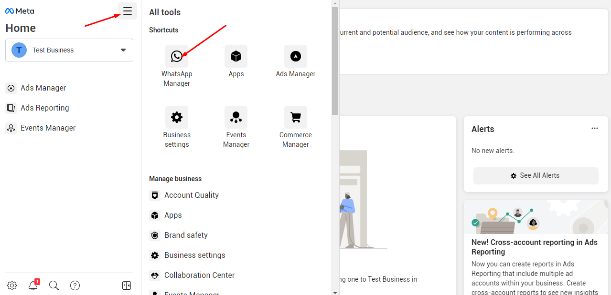

20. Go to `manage message templates`.

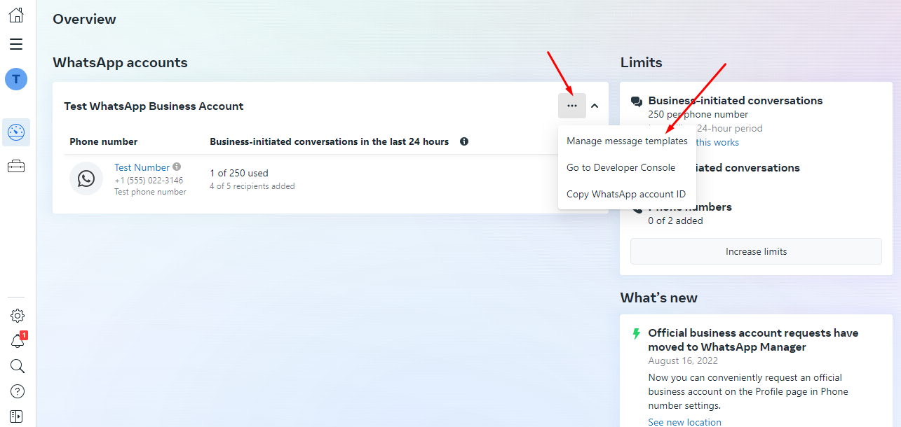

21. Now, `Create template`, then select `Transactional` and input a name and language.

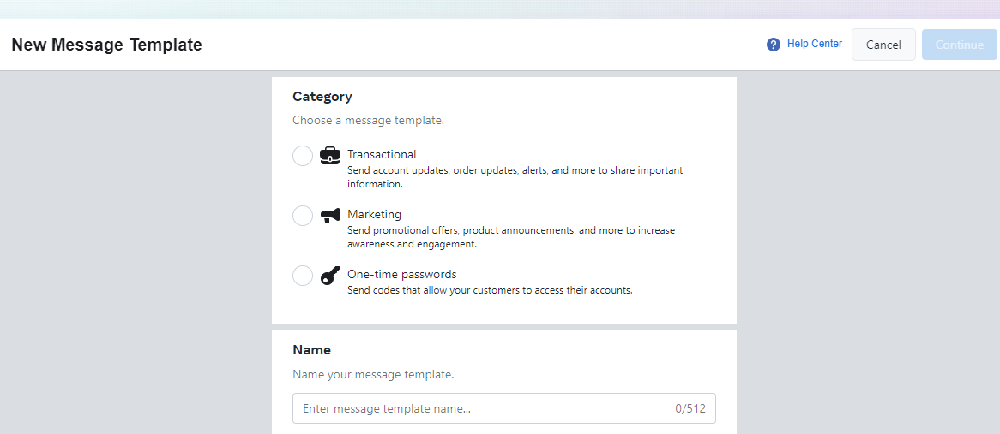

22. Input a `body`, it should contain three variables like this (where `{{1}}` is the name of the customer, `{{2}}` a reference code and `{{3}}` a description):

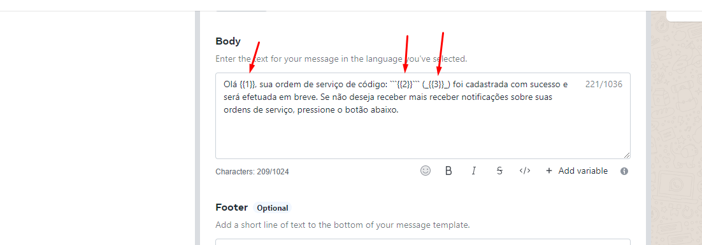

```
Olá {{1}}, sua ordem de serviço de código: ```{{2}}``` (_{{3}}_) foi cadastrada com sucesso e será efetuada em breve. Se não deseja receber mais receber notificações sobre suas ordens de serviço, pressione o botão abaixo.
```

23. Add a button, quick reply and then a name:

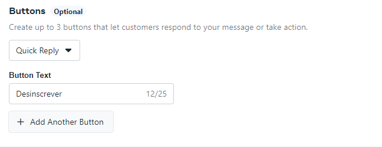

24. Now submit the template for review, it can take up to 24 hours!
25. Update the config file with the template name under `[api]notificationTemplate`.

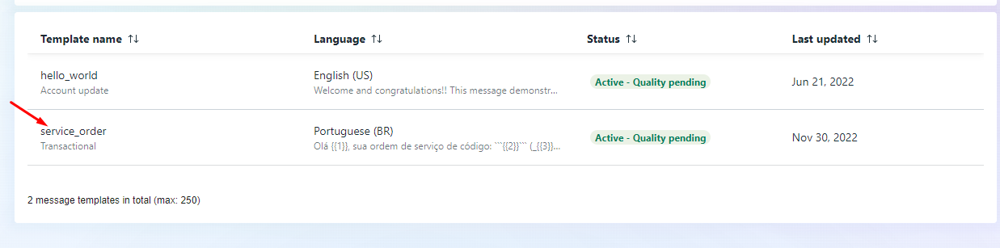

26.  Everything should be configured by now, and after the 24 hours you can fully test the your application, including the template messages.

27. Don't forget to add the test user to fully tests things, add a user phone number to the whatsapp api test recipients, go to `dashboard > whatsapp > getting started`, then click on the recipient drop down then `manage list`.

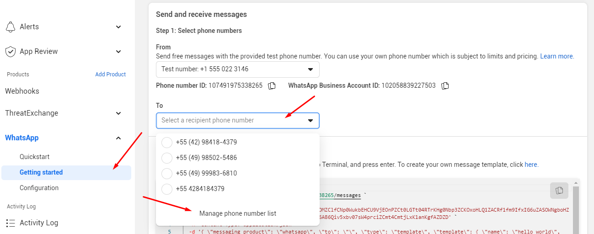

28.  Now add the number, beware of the country code, which should be selected and left out, and to add a 9 in front, the api works with and without a 9 in front, but the test numbers are exact matches and will not work.

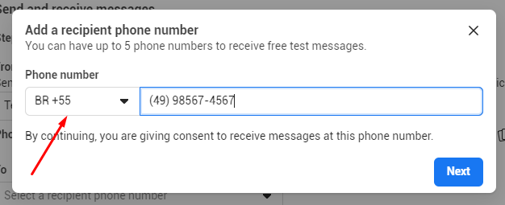

### Live Mode

TODO

### Api config

A sample config for the whatsapp cloud api, this format is used in the [Tests](#tests) for the library.

```ini
[api]
token=api_authetication_token
webhookToken=your_custom_token
phoneid=phone_id
businessAccountid=account_id
notificationTemplate=whatsapp_template_message_name

[data]
receiveNumber=5549999814367
```

* `token`: whatsapp token api, get it on your meta app
* `webhookToken`: a custom token so you can confirm the whatsapp webhook request for webhook registration 
* `phoneid`: the whatsapp id for the phone you wish to send the messages from 
* `businessAccountid`: the whatsapp business account id, used to verify incoming webhooks
* `notificationTemplate`: the template name made in the business manager for whatsapp
* `receiveNumber`: the phone number to send test messages, remember to add it to the allowed list, see [Configuration](#configuration).

# Nuances

## In test mode only registered phone number work

While using the API in test mode, client phones must have their number registered in the whatsapp app dashboard, so as to avoid misuse of the API in test mode. See [Configuration](#configuration).

## Retry messages

Sometimes, after sendind simple messages, the whatsapp cloud API will try and send more messages, this happens because whatsapp has a retry policy, if the first message was not sent, a seconde one is sent, then a third 15 minutes later, then a fourth 6 hours or so after. 

So far i noticed this only happens when there isn't a webhook present to listen to the notification events when these are configured in the whatsapp app on meta developers. Soif you are using webhook, make sure that there is a server registered and working to receive these hooks and responding to then with a HTTP 200, just so the whatsapp cloud API can marks these messages an not to retry them again.

# Tests

Tests are under the [test.dproj](test/test.dproj) project, just compile, copy the [config.ini](test/config.ini) file alongside the compile executable, fill in the cofnig parameters as explained in the chapeter [Api Config](#api-config) then run the tests.

Execute the first time, then respond with a random text, so the whatsapp API can know that you client is engaged and ready to receive other non template messages, the execute a second time, wich shall send lots os messages for testing.

* **Note**: Test messages may be send again and again by the whatsapp API, see the chapter [Retry messages](#retry-messages).

# TODO

* More options for template messages
* More send() type calls, ie. images, sound
